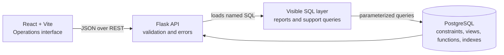
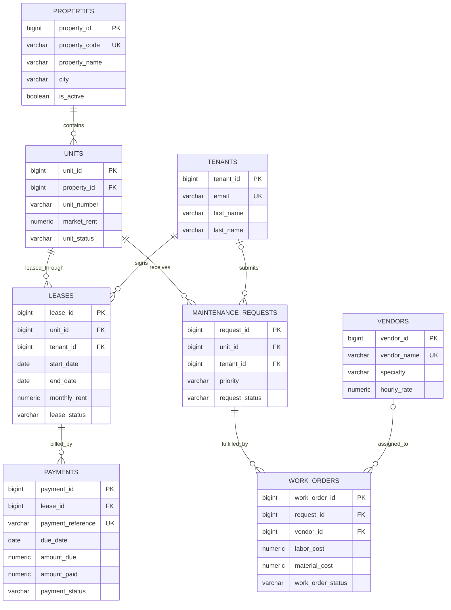

# PropSQL

**Property Management SQL Support & Reporting System**

PropSQL is a small, working property-management system built to demonstrate SQL application support and database-oriented software engineering. PostgreSQL owns the business rules, joins, aggregations, reporting views, validation, and query plans. Flask exposes those queries through a small REST API, and React presents the results in an enterprise operations interface.

This is intentionally **not an AI/ML project**. The optional support assistant maps five known question patterns to approved, read-only SQL reports and always displays the SQL it executes.

## Problem statement

Property teams need consistent answers to operational questions—occupancy, collections, lease risk, and maintenance performance—while support engineers need a repeatable way to investigate incorrect totals and data inconsistencies. PropSQL provides one normalized data model and one visible SQL layer for both needs.

## What it demonstrates

- Normalized relational design with primary keys, foreign keys, unique constraints, and business-rule checks
- **Enterprise PL/pgSQL Stored Procedures** (`create_lease_transaction`) with multi-step atomic writes and `FOR UPDATE` row-level concurrency locking
- **Automated JSONB Audit Trail** (`audit_logs` + `trg_audit_leases`) recording pre/post state changes on database transactions
- **PostgreSQL Full-Text Search** using `to_tsvector` GIN indexing (`idx_maintenance_fts`) and `ts_rank` match scoring
- **Materialized Performance Views** (`property_performance_mat_view`) with unique index support for high-throughput reporting
- **Role-Based Access Control (RBAC)** across 4 user personas (`Property Manager`, `Support Engineer`, `Tenant Resident`, `Vendor`) enforced in Flask middleware
- Production-style SQL reports with joins, CTEs, conditional aggregation, subqueries, date logic, and window functions
- Ten documented application-support cases from symptom through validation
- Three `EXPLAIN`/`EXPLAIN ANALYZE` optimization comparisons with live JSON tree visualization
- Database consistency checks and an executable PASS/FAIL SQL test runner

## Architecture



The backend deliberately does not rebuild report logic in Python. `backend/query_loader.py` extracts query blocks marked with `-- name:` from `sql/07_reports.sql`, `sql/09_optimization.sql`, and `sql/11_api_queries.sql`.

## Database schema and ER diagram



The eight core tables are in third normal form: property data is stored once, tenant identity is separated from lease history, payments reference leases, and vendor assignments live on work orders. `unit_status` is an operational cache; date-valid leases remain the reporting source of truth, and validation checks catch disagreement.

## Realistic data volume

`database/seed.sql` uses deterministic PostgreSQL `generate_series` statements rather than a fragile multi-thousand-line insert file. A normal load creates:

| Entity | Rows |
|---|---:|
| Properties | 25 |
| Units | 300 |
| Tenants | 260 |
| Leases | 440 |
| Payments | 2,500+ (date-dependent, always 1,000+) |
| Maintenance requests | 420 |
| Vendors | 40 |
| Work orders | 380 |

The data includes vacant units, current and expired leases, paid/late/pending/partial charges, varied rents and cities, maintenance priorities, open and closed requests, and vendor specialties.

## SQL concepts, with reasons

- **INNER JOIN:** used when a report row is invalid without both related records—for example, lease plus tenant.
- **LEFT JOIN:** keeps parent records such as vacant units or properties with no requests.
- **CTEs:** pre-aggregate expected rent and collected payments separately. This makes the grain explicit and prevents one-to-many join fan-out.
- **Correlated `EXISTS`:** answers “does this unit have a current lease?” without producing duplicate unit rows.
- **Window functions:** `ROW_NUMBER` selects the most recent payment per tenant, running `SUM` shows monthly progress, and `DENSE_RANK` handles tied collection rates.
- **Conditional aggregation:** `FILTER (WHERE ...)` calculates occupied/vacant or open/closed metrics in one grouped scan.
- **Views:** capture shared business definitions so dashboard and reports do not disagree.
- **Indexes:** target foreign-key joins, lease status/end-date filters, payment lease/due-date access, maintenance status, and case-insensitive tenant names.
- **Validation queries:** return exceptions to rules that constraints or cross-table business logic should prevent.

The progressive examples live in `sql/01_basic_queries.sql` through `sql/06_window_functions.sql`; production reports live in `sql/07_reports.sql`.

## Reporting

| Report | Main SQL idea |
|---|---|
| Property occupancy | `EXISTS` plus conditional aggregation counts each unit once |
| Rent collection | Expected and collected CTEs meet at property/month grain |
| Lease expiry | Parameterized 30/60/90-day date range and `CASE` bucket |
| Tenant payment history | Five-table join with optional tenant parameter |
| Delinquent tenants | `HAVING`, filtered counts, and outstanding balance |
| Maintenance performance | Open/closed/high-priority counts and resolution interval average |
| Property performance | Joins three already-aggregated property views |

## Views and functions

- `active_leases_view` centralizes status plus date validity.
- `property_occupancy_view` prevents occupancy over 100% by counting units via `EXISTS`.
- `rent_collection_view` aligns expected and paid values at property/month grain.
- `maintenance_summary_view` supplies consistent request and resolution metrics.
- `calculate_property_occupancy(property_id)` and `calculate_lease_outstanding(lease_id)` expose reusable calculations.
- `property_summary(property_id)` returns a compact cross-domain property snapshot.

## Application-support cases

Each file in `support_cases/` contains Problem, Investigation SQL, Expected Result, Actual Result, Root Cause, Fix, and Validation SQL:

1. Occupancy above 100%
2. Inflated monthly rent
3. Tenant duplicated by a detail join
4. Occupied unit without an active lease
5. Payment without a valid lease
6. Expired lease in an active report
7. Inconsistent maintenance/work-order statuses
8. Duplicate payment records
9. Unusually high maintenance cost
10. Incorrect totals after joining multiple fact tables

Most cases diagnose a faulty query while keeping the main seed dataset healthy. This mirrors support work: reproduce the bad behavior, isolate the report grain or data rule, apply the smallest fix, and run a zero-row validation.

## Query optimization

`sql/09_optimization.sql` contains three before/after examples:

1. Replace a function-wrapped lease date with a sargable range that can use `idx_leases_status_end`.
2. Replace a concatenated leading-wildcard tenant search with an expression-indexed surname lookup.
3. Replace repeated correlated payment aggregation with one grouped CTE and join.

The Query Performance screen requests `EXPLAIN (FORMAT JSON, COSTS, VERBOSE)` from the connected database. The SQL script also provides `EXPLAIN (ANALYZE, BUFFERS)` commands for local investigation. PostgreSQL may choose a sequential scan on this student-size dataset; that is valid when its cost model predicts it is cheaper. Compare nodes, predicates, row estimates, loops, and index eligibility—not copied timing claims.

## Testing and validation

Run `sql/10_validation.sql` for twelve exception reports. A healthy database returns zero rows for each. Run `testing/sql_tests.sql` for named expected/actual/PASS results and automated exceptions on critical failures.

Backend unit tests confirm that required SQL blocks load and every assistant query passes the read-only validator.

```bash
cd backend
pytest -q
```

## REST API

| Method | Route | Purpose |
|---|---|---|
| GET | `/api/health` | API/database readiness |
| GET | `/api/dashboard` | Dashboard bundle |
| GET | `/api/properties`, `/units`, `/tenants`, `/leases`, `/payments`, `/maintenance` | Paginated operational data |
| GET | `/api/reports/occupancy` | Occupancy report |
| GET | `/api/reports/rent-collection?month=2026-09-01` | Monthly collections |
| GET | `/api/reports/lease-expiry?days=30` | 30/60/90-day lease risk |
| GET | `/api/reports/tenant-payment-history?tenant_id=1` | Tenant ledger |
| GET | `/api/reports/delinquent-tenants` | Delinquency report |
| GET | `/api/reports/maintenance` | Maintenance performance |
| GET | `/api/reports/property-performance` | Combined metrics |
| GET | `/api/support/cases` and `/:id` | Troubleshooting library |
| GET | `/api/performance` | Live before/after plans |
| POST | `/api/assistant` | Approved read-only question mapping |

Errors return useful messages without credentials or stack traces. User values are validated and passed to psycopg2 parameters rather than string interpolation.

## Technology stack

- PostgreSQL 14+
- Python 3.10+, Flask, psycopg2
- React 19, Vite, Recharts
- Plain CSS
- Git/GitHub-friendly configuration through `.env`

## Setup

### 1. Create the database

Install and start PostgreSQL. In `psql` as an administrator:

```sql
CREATE ROLE propsql_user WITH LOGIN PASSWORD 'choose_a_local_password';
CREATE DATABASE propsql OWNER propsql_user;
```

Copy `.env.example` to `.env` and set the same password in `DATABASE_URL`. Never commit `.env`.

From the project root, initialize everything in dependency order:

```bash
psql "$DATABASE_URL" -f database/setup.sql
psql "$DATABASE_URL" -f testing/sql_tests.sql
```

On Windows PowerShell, after setting `$env:DATABASE_URL`, use the same `psql` commands. `database/setup.sql` uses psql-relative `\ir` includes and stops on the first SQL error.

### 2. Start Flask

```bash
cd backend
python -m venv .venv
# Windows: .venv\Scripts\Activate.ps1
# macOS/Linux: source .venv/bin/activate
pip install -r requirements.txt
python app.py
```

The API runs at `http://localhost:5000`. Check `http://localhost:5000/api/health`.

### 3. Start React

In another terminal:

```bash
cd frontend
npm install
npm run dev
```

Open `http://localhost:5173`. The UI intentionally contains no fallback report data; if PostgreSQL or Flask is unavailable it shows a recovery message.

## Example queries

```sql
-- Properties below 80% occupancy
SELECT property_name, occupied_units, total_units, occupancy_percentage
FROM property_occupancy_view
WHERE occupancy_percentage < 80
ORDER BY occupancy_percentage;

-- Lease risk in the next 30 days
SELECT tenant_id, property_id, unit_number, end_date
FROM active_leases_view
WHERE end_date BETWEEN CURRENT_DATE AND CURRENT_DATE + 30
ORDER BY end_date;

-- Outstanding balance for one lease
SELECT calculate_lease_outstanding(42);
```

## Project structure

```text
PropSQL/
├── database/           schema, deterministic seed, indexes, views, functions, setup
├── sql/                learning queries, production reports, support, optimization, validation, API queries
├── support_cases/      ten documented SQL investigations
├── testing/            executable SQL test runner
├── backend/            Flask API, SQL loader, services, tests
├── frontend/           React/Vite operations interface
├── README.md
├── INTERVIEW_NOTES.md
├── .env.example
└── .gitignore
```

## Screenshots

After running the stack, capture these portfolio views using your own live database:

- Operations dashboard with occupancy and collection summaries
- Property Performance report table
- SQL Support case showing investigation, root cause, fix, and validation
- Query Performance before/after execution plans

Live screenshots are intentionally not fabricated or bundled as static UI data.

## Completed Enterprise Enhancements

- ✅ **Authenticated Roles & RBAC**: Implemented 4 operational personas (`Property Manager`, `Support Engineer`, `Tenant Resident`, `Vendor`) with backend middleware role enforcement.
- ✅ **PL/pgSQL Transaction Procedures**: Multi-step write operations (`create_lease_transaction`) with `FOR UPDATE` row-level concurrency locking.
- ✅ **Automated Audit Triggers**: Database-level JSONB change tracking (`audit_logs`) fired on `INSERT`/`UPDATE`/`DELETE` operations.
- ✅ **Full-Text GIN Indexing**: High-performance text searching (`tsvector`, `plainto_tsquery`, `ts_rank`) on maintenance requests.
- ✅ **Materialized Analytical Views**: Materialized view (`property_performance_mat_view`) for zero-latency portfolio performance queries.
- ✅ **Interactive Role-Based Write Actions**: Inline status transitions for maintenance tickets, payments, and leases based on active role authorization.

## Portfolio positioning

Lead with this sentence: **“PropSQL is an enterprise PostgreSQL property operations & database engineering system demonstrating transactional write safety, stored procedures, JSONB audit triggers, full-text indexing, role-based security, query optimization, and live execution plan analysis.”**
